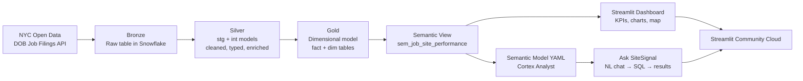

# 🏗️ SiteSignal — Job Site Performance Dashboard

An end-to-end analytics project that turns raw NYC construction permit data into
a job site performance dashboard with a natural-language AI assistant —
built on **Snowflake**, **dbt**, and **Streamlit**, using **Snowflake Cortex Analyst**
for semantic-layer-powered Q&A.

> Built as a portfolio project demonstrating a modern data stack: medallion
> architecture, dimensional modeling, a semantic layer, and generative AI
> analytics — applied to a real-world construction operations use case.

---

## 🔍 What it does

SiteSignal tracks every construction job application filed with the NYC
Department of Buildings and turns it into operational intelligence:

- **At-risk job detection** — flags jobs stuck in review for over 180 days
- **Pipeline visibility** — see where every job sits in its lifecycle (pre-filing → in review → approved → permit issued → completed)
- **Cost & schedule analysis** — review times and pipeline value by borough, job type, and project size
- **Ask SiteSignal** — a chat interface where anyone can ask questions in plain English (*"Which borough has the most at-risk jobs?"*) and get an instant chart-backed answer, powered by Cortex Analyst

---

## 🏛️ Architecture



**Medallion layers:**

| Layer | What it holds | Tooling |
|---|---|---|
| 🥉 Bronze | Raw NYC DOB job filings, loaded as-is | Snowflake table |
| 🥈 Silver | Cleaned/typed staging model + enriched intermediate model (KPIs, status flags, at-risk logic) | dbt |
| 🥇 Gold | Star schema — `fact_job_filings` + `dim_location`, `dim_job_type`, `dim_cost_bucket`, `dim_job_status`, `dim_date` | dbt (incremental models) |
| 🧠 Semantic | `sem_job_site_performance` view + Cortex Analyst semantic model YAML (dimensions, metrics, verified queries) | Snowflake view + YAML |
| 📊 App | Dashboard + AI chat | Streamlit, deployed on Streamlit Community Cloud |

---

## 🧰 Tech stack

- **Data warehouse:** Snowflake
- **Transformation:** dbt (staging → intermediate → marts, incremental models, seeds, tests)
- **Modeling approach:** Medallion architecture + Kimball-style star schema (one fact table, five dimensions)
- **Semantic layer:** Snowflake semantic view + Cortex Analyst semantic model (YAML)
- **AI / NL Q&A:** Snowflake Cortex Analyst (text-to-SQL over the semantic model)
- **Dashboard:** Streamlit + Plotly
- **Deployment:** Streamlit Community Cloud

---

## 📁 Project structure

```
.
├── models/
│   ├── staging/
│   │   └── stg_dob__job_filings.sql       # cleaned, typed source data
│   ├── intermediate/
│   │   └── int_job_filings_enriched.sql   # status logic, KPIs, at-risk flag
│   ├── marts/
│   │   ├── dim_date.sql
│   │   ├── dim_location.sql               # incremental
│   │   ├── dim_job_type.sql               # incremental
│   │   ├── dim_cost_bucket.sql
│   │   ├── dim_job_status.sql
│   │   ├── fact_job_filings.sql           # incremental, SCD Type 1
│   │   └── _marts.yml                     # tests: unique, not_null, relationships
│   └── analytics/
│       └── job_site_performance.sql       # flattened view for dashboard + Cortex
├── seeds/
│   └── dob_job_status_codes.csv           # job status code → lifecycle stage lookup
├── semantic_models/
│   └── job_site_performance.yaml          # Cortex Analyst semantic model
└── streamlit_app/
    ├── app.py
    ├── requirements.txt
    └── .streamlit/
        └── secrets.toml.example
```

---

## 📊 Data model

A single fact table (`fact_job_filings`) joined to five dimensions:

| Table | Grain | Notes |
|---|---|---|
| `fact_job_filings` | One row per job application | SCD Type 1, incremental merge on `job_id` |
| `dim_location` | One row per borough/block/lot | Lat/lon for mapping |
| `dim_job_type` | One row per job type / building type / occupancy combo | New Building, Major/Minor Alteration, Demolition |
| `dim_cost_bucket` | 4 cost tiers | `<100K`, `100K-500K`, `500K-2M`, `2M+` |
| `dim_job_status` | 15 DOB status codes | Mapped to 7 lifecycle `stage_group`s (PRE_FILING → COMPLETED, plus DISAPPROVED/SUSPENDED) |
| `dim_date` | Calendar spine | 2000 → present + 1 year |

**Key derived metrics:**
- `days_in_review` = `latest_action_date - filing_date`
- `days_to_approval` = `approval_date - filing_date` (null until approved)
- `is_at_risk` = active job with `days_in_review > 180`

---

## 🧠 Semantic layer & Cortex Analyst

`semantic_models/job_site_performance.yaml` defines:

- **18 dimensions** (borough, stage_group, cost_bucket, status flags, etc.)
- **5 time dimensions** (filing_date, approval_date, filing_month, etc.)
- **8 pre-built metrics** (`at_risk_rate`, `avg_days_in_review`, `total_job_value`, `approval_rate`, etc.) with synonyms for natural language matching
- **4 verified queries** as gold-standard examples for common questions

This lets Cortex Analyst translate questions like *"What percentage of large jobs get approved within 90 days?"* into correct SQL against `sem_job_site_performance` — no hardcoded filters or manual query-building required.

---

## 🚀 Running it yourself

### 1. Set up Snowflake + dbt

```bash
dbt seed              # load job status lookup
dbt run               # build staging → intermediate → marts → semantic view
dbt test              # run data quality tests
```

### 2. Upload the semantic model

Upload `semantic_models/job_site_performance.yaml` to a Snowflake stage and grant
your role `SNOWFLAKE.CORTEX_USER`. A network policy must also be attached to your
user/account for Cortex Analyst's REST API (Programmatic Access Token auth):

```sql
CREATE NETWORK POLICY sitesignal_policy ALLOWED_IP_LIST = ('0.0.0.0/0');
ALTER USER <your_username> SET NETWORK_POLICY = sitesignal_policy;
```

### 3. Run the dashboard

```bash
cd streamlit_app
pip install -r requirements.txt
cp .streamlit/secrets.toml.example .streamlit/secrets.toml   # fill in credentials
streamlit run app.py
```

### 4. Deploy

Push to GitHub, then deploy on [Streamlit Community Cloud](https://share.streamlit.io),
adding your Snowflake credentials and Cortex PAT under the app's **Secrets**.

---

## 📦 Data source

[NYC DOB Job Application Filings](https://data.cityofnewyork.us/Housing-Development/DOB-Job-Application-Filings/ic3t-wcy2/about_data)
— published by NYC Open Data, 1M+ historical construction
permit applications across all five boroughs.

---

## 🛣️ Possible next steps

- SCD Type 2 history via dbt snapshots, to enable stage-duration / funnel trend analysis
- Expand the semantic model with additional verified queries as real usage patterns emerge
- Add scheduled dbt runs (e.g. via dbt Cloud or Airflow) for automatic data refresh
- Extend to additional NYC Open Data sources (DOB permits, violations, complaints) for a fuller project lifecycle view

---

## 📄 License

This project uses public data from NYC Open Data. Code in this repo is provided as-is for portfolio/demonstration purposes.
